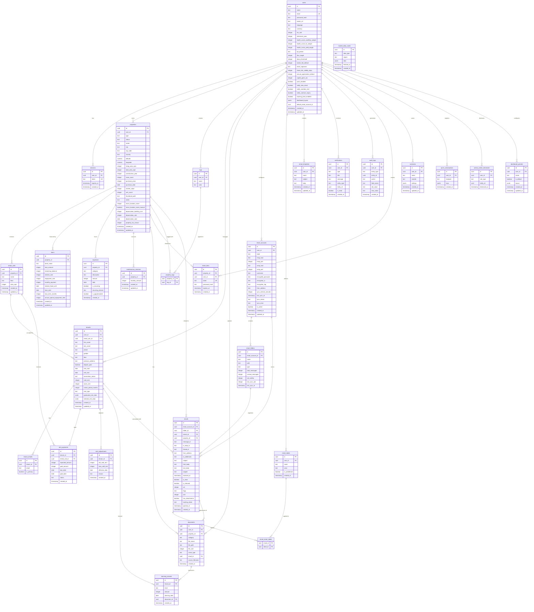

# Immo Manager - Entity Relationship Diagram

```mermaid
erDiagram
    %% ============================================================
    %% CORE ENTITIES
    %% ============================================================

    users {
        uuid id PK
        text name
        text email UK
        text password_hash
        text avatar_url
        text language
        text currency
        integer tax_rate
        integer retirement_year
        integer health_score_cashflow_weight
        integer health_score_ltv_weight
        integer health_score_yield_weight
        text kpi_period
        integer dscr_target
        integer donut_threshold
        integer broker_fee_default
        text email_signature
        integer share_link_validity_days
        integer annual_appreciation_default
        integer capital_gains_tax
        boolean push_enabled
        boolean notify_new_email
        boolean notify_overdue_rent
        boolean notify_contract_expiry
        boolean tracking_pixel_enabled
        jsonb dashboard_layout
        uuid default_email_account_id
        timestamp created_at
        timestamp updated_at
    }

    sessions {
        uuid id PK
        uuid user_id FK
        text token UK
        timestamp expires_at
        timestamp created_at
    }

    properties {
        uuid id PK
        uuid user_id FK
        text type
        text status
        text street
        text city
        text zip_code
        text country
        numeric latitude
        numeric longitude
        integer living_area_sqm
        integer land_area_sqm
        integer construction_year
        integer room_count
        integer purchase_price
        date purchase_date
        integer market_value
        integer unit_count
        text thumbnail_path
        text notes
        integer micro_location_score
        boolean micro_location_score_manual
        integer depreciation_building_cost
        integer depreciation_rate
        date depreciation_start
        integer property_tax_annual
        timestamp created_at
        timestamp updated_at
    }

    %% ============================================================
    %% PROPERTY SUB-ENTITIES
    %% ============================================================

    rental_units {
        uuid id PK
        uuid property_id FK
        text name
        text floor
        integer area_sqm
        timestamp created_at
        timestamp updated_at
    }

    loans {
        uuid id PK
        uuid property_id FK
        text bank_name
        integer loan_amount
        integer remaining_balance
        integer interest_rate
        integer repayment_rate
        integer monthly_payment
        date interest_fixed_until
        date loan_start
        integer loan_term_months
        integer annual_special_repayment_limit
        timestamp created_at
        timestamp updated_at
    }

    expenses {
        uuid id PK
        uuid property_id FK
        text category
        text description
        integer amount
        date date
        boolean is_recurring
        text recurring_interval
        boolean is_apportionable
        timestamp created_at
    }

    maintenance_reserves {
        uuid id PK
        uuid property_id FK
        integer monthly_amount
        timestamp created_at
        timestamp updated_at
    }

    %% ============================================================
    %% TENANT DOMAIN
    %% ============================================================

    tenants {
        uuid id PK
        uuid user_id FK
        uuid rental_unit_id FK
        text first_name
        text last_name
        text phone
        text gender
        text iban
        text previous_address
        boolean deposit_paid
        date rent_start
        date rent_end
        text termination_status
        integer cold_rent
        integer warm_rent
        integer notice_period_months
        text rent_type
        jsonb graduated_rent_data
        jsonb indexed_rent_data
        timestamp created_at
        timestamp updated_at
    }

    tenant_emails {
        uuid id PK
        uuid tenant_id FK
        text email
        boolean is_primary
    }

    rent_payments {
        uuid id PK
        uuid tenant_id FK
        uuid rental_unit_id FK
        integer expected_amount
        integer paid_amount
        date due_date
        date paid_date
        text status
        timestamp created_at
    }

    rent_adjustments {
        uuid id PK
        uuid tenant_id FK
        integer old_cold_rent
        integer new_cold_rent
        date effective_date
        text reason
        timestamp created_at
    }

    dunning_records {
        uuid id PK
        uuid tenant_id FK
        text level
        integer amount
        date dunning_date
        uuid document_id FK
        timestamp created_at
    }

    %% ============================================================
    %% TAGS (Many-to-Many)
    %% ============================================================

    tags {
        uuid id PK
        uuid user_id FK
        text name
        text color
    }

    property_tags {
        uuid property_id PK
        uuid tag_id PK
    }

    %% ============================================================
    %% DOCUMENTS
    %% ============================================================

    documents {
        uuid id PK
        uuid user_id FK
        uuid property_id FK
        text category
        text file_name
        text file_path
        integer file_size
        text mime_type
        uuid email_id FK
        text source_filename
        timestamp created_at
    }

    %% ============================================================
    %% EMAIL SYSTEM
    %% ============================================================

    email_accounts {
        uuid id PK
        uuid user_id FK
        text label
        text imap_host
        integer imap_port
        text smtp_host
        integer smtp_port
        text username
        text encrypted_password
        text encryption_iv
        text encryption_tag
        text from_address
        integer sync_interval_minutes
        timestamp last_sync_at
        text sync_status
        text sync_error
        boolean is_active
        timestamp created_at
        timestamp updated_at
    }

    email_folders {
        uuid id PK
        uuid email_account_id FK
        text name
        text path
        text type
        integer total_messages
        integer unread_messages
        integer uid_validity
        integer last_sync_uid
        timestamp last_sync_at
    }

    emails {
        uuid id PK
        uuid email_account_id FK
        uuid folder_id FK
        uuid tenant_id FK
        uuid property_id FK
        text message_id
        text in_reply_to
        text thread_id
        text from_address
        text to_addresses
        text subject
        text html_body
        text text_body
        text snippet
        timestamp received_at
        boolean is_read
        boolean is_inbound
        integer uid
        text flags
        integer size
        boolean has_attachments
        text tracking_token
        timestamp opened_at
        timestamp created_at
    }

    email_labels {
        uuid id PK
        uuid user_id FK
        text name
        text color
        boolean is_predefined
        timestamp created_at
    }

    email_email_labels {
        uuid email_id PK
        uuid label_id PK
    }

    email_templates {
        uuid id PK
        uuid user_id FK
        text name
        text subject
        text body
        timestamp created_at
        timestamp updated_at
    }

    %% ============================================================
    %% NOTIFICATIONS & AUDIT
    %% ============================================================

    notifications {
        uuid id PK
        uuid user_id FK
        text type
        text title
        text message
        text entity_type
        uuid entity_id
        boolean is_read
        timestamp created_at
    }

    audit_logs {
        uuid id PK
        uuid user_id FK
        text entity_type
        uuid entity_id
        text action
        text field_name
        text old_value
        text new_value
        timestamp created_at
    }

    %% ============================================================
    %% SHARING & SCENARIOS
    %% ============================================================

    share_links {
        uuid id PK
        uuid property_id FK
        uuid user_id FK
        text token UK
        text password_hash
        timestamp expires_at
        timestamp created_at
    }

    scenarios {
        uuid id PK
        uuid user_id FK
        text name
        text module
        jsonb settings
        timestamp created_at
        timestamp updated_at
    }

    %% ============================================================
    %% STANDALONE / AUXILIARY
    %% ============================================================

    market_data_cache {
        uuid id PK
        text data_type
        text region
        jsonb data
        timestamp fetched_at
        timestamp created_at
    }

    push_subscriptions {
        uuid id PK
        uuid user_id FK
        text endpoint
        jsonb keys
        timestamp created_at
    }

    action_center_dismissed {
        uuid id PK
        uuid user_id FK
        text rule_type
        uuid entity_id
        timestamp dismissed_at
    }

    dashboard_presets {
        uuid id PK
        uuid user_id FK
        text name
        boolean is_default
        jsonb layout
        timestamp created_at
        timestamp updated_at
    }

    %% ============================================================
    %% RELATIONSHIPS
    %% ============================================================

    %% User owns...
    users ||--o{ sessions : "has"
    users ||--o{ properties : "owns"
    users ||--o{ tags : "creates"
    users ||--o{ tenants : "manages"
    users ||--o{ documents : "uploads"
    users ||--o{ email_accounts : "configures"
    users ||--o{ email_labels : "defines"
    users ||--o{ email_templates : "creates"
    users ||--o{ notifications : "receives"
    users ||--o{ audit_logs : "generates"
    users ||--o{ share_links : "creates"
    users ||--o{ scenarios : "saves"
    users ||--o{ push_subscriptions : "registers"
    users ||--o{ action_center_dismissed : "dismisses"
    users ||--o{ dashboard_presets : "configures"

    %% Property hierarchy
    properties ||--o{ rental_units : "contains"
    properties ||--o{ loans : "financed by"
    properties ||--o{ expenses : "incurs"
    properties ||--o{ maintenance_reserves : "reserves"
    properties ||--o{ documents : "has"
    properties ||--o{ share_links : "shared via"

    %% Tags many-to-many
    properties ||--o{ property_tags : "tagged with"
    tags ||--o{ property_tags : "applied to"

    %% Tenant domain
    rental_units ||--o{ tenants : "occupied by"
    tenants ||--o{ tenant_emails : "has"
    tenants ||--o{ rent_payments : "pays"
    tenants ||--o{ rent_adjustments : "adjusted"
    tenants ||--o{ dunning_records : "dunned"

    %% Rent payments also reference rental unit
    rental_units ||--o{ rent_payments : "receives"

    %% Dunning records optionally link to documents
    documents ||--o{ dunning_records : "attached to"

    %% Email system
    email_accounts ||--o{ email_folders : "contains"
    email_accounts ||--o{ emails : "stores"
    email_folders ||--o{ emails : "organizes"

    %% Email contextual links
    tenants ||--o{ emails : "associated with"
    properties ||--o{ emails : "related to"

    %% Email labels many-to-many
    emails ||--o{ email_email_labels : "labeled"
    email_labels ||--o{ email_email_labels : "applied to"

    %% Documents from emails
    emails ||--o{ documents : "attachment of"
```
